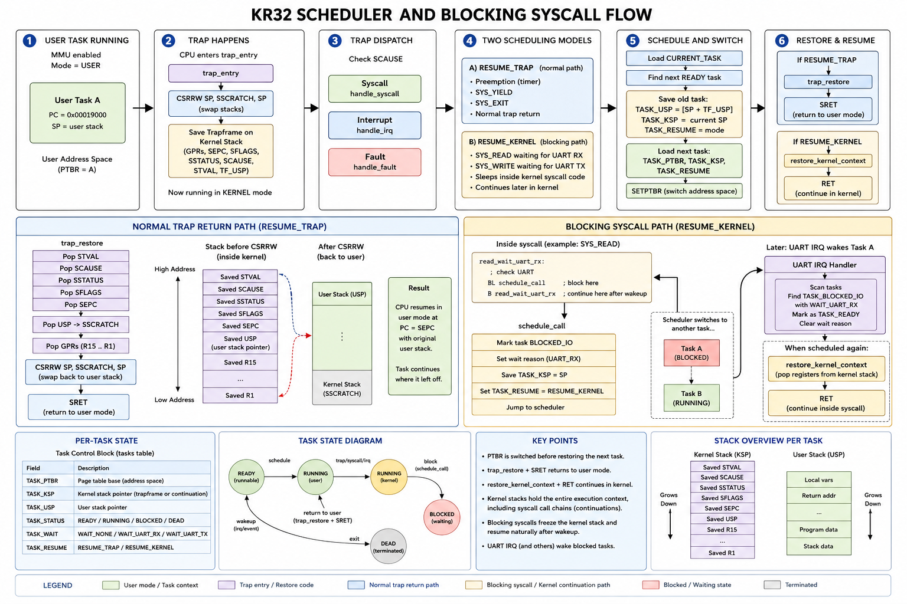

Updated version including the new blocking-kernel continuation model:

---

# KR32 Scheduler and Blocking Syscall Flow

Legend:
KSP        = kernel stack pointer
USP        = interrupted user stack pointer
PTBR       = page table base register
SEPC       = saved user PC for resume
SSCRATCH   = scratch CSR used for stack swap
TF_*       = trapframe fields stored on kernel stack
RESUME_TRAP   = resume through trap_restore + SRET
RESUME_KERNEL = resume directly inside kernel via RET

# Overview

KR32 uses:

* per-task virtual memory spaces
* per-task kernel stacks
* trapframe-based context switching
* preemptive scheduling
* blocking syscalls with kernel continuations

A task may be interrupted:

* while running user code
* OR while sleeping inside kernel syscall code

The scheduler supports both resume paths.

---

1. User task runs in its address space

---

* MMU enabled
* CPU running in USER mode
* Task executes user code at:

  * 0x00008000
  * 0x00019000
  * 0x0001A000

User task owns:

* its own PTBR/page table
* its own user stack
* its own kernel stack

---

2. Trap happens (syscall / interrupt / fault)

---

CPU enters `trap_entry`.

Stack swap:

```asm
CSRRW SP SSCRATCH SP
```

Before swap:

* SP = user stack
* SSCRATCH = kernel stack

After swap:

* SP = kernel stack
* SSCRATCH = interrupted user stack

Kernel then saves full task context onto kernel stack:

Saved GPRs:

* R1-R15

Saved privileged state:

* SEPC
* SFLAGS
* SSTATUS
* SCAUSE
* STVAL

User SP is saved into:

* `TF_USP`

Result:

* full interrupted execution state exists on kernel stack
* kernel may now safely schedule another task

---

3. Trap dispatch

---

Kernel checks `SCAUSE`.

Possible paths:

Syscalls:

```text
handle_syscall
  -> syscall_read
  -> syscall_write
  -> syscall_exit
  -> syscall_yield
```

Interrupts:

```text
handle_irq
  -> timer IRQ
  -> UART IRQ
```

Faults:

```text
page fault
invalid instruction
divide by zero
```

---

4. Two scheduling models exist

---

KR32 supports TWO execution-resume models.

## A) RESUME_TRAP

Normal interrupt/syscall scheduling.

Task resumes through:

```text
trap_restore
  -> SRET
```

Used when task was interrupted in:

* user mode
* normal trap handling

## B) RESUME_KERNEL

Blocking syscall continuation scheduling.

Task resumes:

* directly inside kernel
* via RET
* continuing after `BL schedule_call`

Used when task sleeps inside kernel syscall code.

Example:

```asm
read_wait_uart_rx:
    BL schedule_call
    B read_wait_uart_rx
```

When resumed:

* execution continues after `BL schedule_call`
* syscall continues naturally

This creates kernel continuations.

---

5. Normal scheduler path (`schedule_and_switch`)

---

Used for:

* timer preemption
* SYS_YIELD
* SYS_EXIT
* normal trap scheduling

Scheduler steps:

1. Load:

```text
CURRENT_TASK
```

2. Find next READY task

3. Save old task state:

```text
TASK_USP <- [SP + TF_USP]
TASK_KSP <- current kernel SP
TASK_RESUME <- RESUME_TRAP
```

4. Load next task:

```text
TASK_PTBR
TASK_KSP
TASK_RESUME
```

5. Switch virtual memory:

```asm
SETPTBR R7
```

6. Restore next task:

If:

```text
TASK_RESUME == RESUME_TRAP
```

then:

```text
trap_restore -> SRET
```

Else:

```text
restore_kernel_context -> RET
```

---

6. Blocking syscall scheduling (`schedule_call`)

---

Used when syscall cannot complete immediately.

Example:

* SYS_READ waiting for UART RX
* SYS_WRITE waiting for UART TX

Flow:

1. Syscall marks task:

```text
TASK_BLOCKED_IO
WAIT_UART_RX / WAIT_UART_TX
```

2. Syscall calls:

```asm
BL schedule_call
```

3. `schedule_call` saves:

```text
TASK_KSP <- current kernel SP
TASK_RESUME <- RESUME_KERNEL
```

IMPORTANT:

* kernel call stack is preserved
* syscall local state is preserved
* return addresses are preserved

4. Scheduler switches to another READY task

5. UART interrupt wakes blocked task

6. Later scheduler restores blocked task:

```text
restore_kernel_context
```

7. Kernel registers restored

8. RET executes

9. Syscall continues exactly after:

```asm
BL schedule_call
```

This is a kernel continuation model.

---

7. `trap_restore`

---

Normal trap restore path.

Restores:

* STVAL
* SCAUSE
* SSTATUS
* SFLAGS
* SEPC

Restores:

* interrupted user SP into SSCRATCH

Restores:

* all GPRs

Final stack swap:

```asm
CSRRW SP SSCRATCH SP
```

After swap:

* SP = interrupted task stack
* SSCRATCH = kernel stack

Final return:

```asm
SRET
```

CPU resumes:

* user mode
* pc = SEPC

---

8. `restore_kernel_context`

---

Kernel continuation restore path.

Used when:

```text
TASK_RESUME == RESUME_KERNEL
```

Restores:

* saved kernel registers
* LR/R15
* kernel stack state

Then:

```asm
RET
```

NOT:

```asm
SRET
```

Execution resumes:

* inside kernel
* inside blocked syscall
* after previous `BL schedule_call`

---

9. UART wakeup model

---

UART IRQ handler:

1. ACK interrupt

2. Scan task table

3. Find:

```text
TASK_BLOCKED_IO
```

4. Match wait reason:

```text
WAIT_UART_RX
WAIT_UART_TX
```

5. Mark task:

```text
TASK_READY
WAIT_NONE
```

Task becomes runnable again.

---

10. Important architectural properties

---

## Per-task kernel stacks

Each task owns independent:

* kernel stack
* trapframe
* continuation state

## No register copying between tasks

Scheduler does NOT manually move registers between tasks.

Instead:

* each task already owns its saved trapframe/kernel stack
* scheduler only swaps stack pointers

## Kernel continuations

Blocked syscalls resume naturally because:

* entire kernel call chain remains frozen on task kernel stack

## Address-space switching

PTBR changes BEFORE restore:

```asm
SETPTBR R7
```

Thus:

* correct user mappings exist before returning to user mode

## Race-safe blocking

Before sleeping:

* task marks itself BLOCKED
* device state is rechecked

This prevents lost wakeups.



# Notes

* `trap_entry` and `trap_restore` form the standard user/kernel transition mechanism.
* `schedule_call` introduces schedulable kernel continuations.
* Blocking syscalls no longer require SEPC rewinding tricks.
* Kernel stacks now preserve:

  * trapframes
  * syscall local execution state
  * return chains
  * continuation points
* KR32 now supports:

  * preemptive multitasking
  * blocking I/O
  * resumable kernel execution
  * per-process address spaces
  * device-driven wakeups
